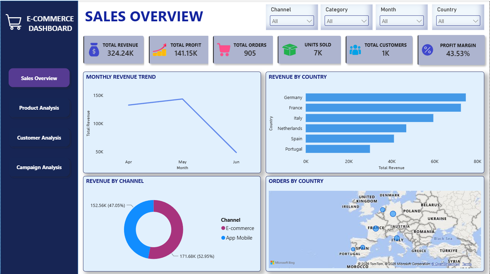
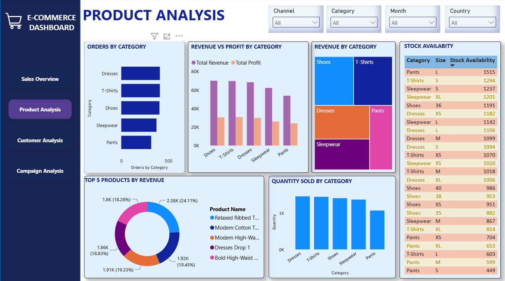
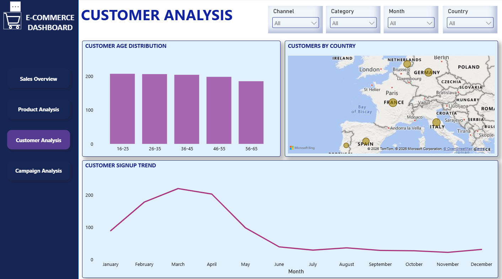
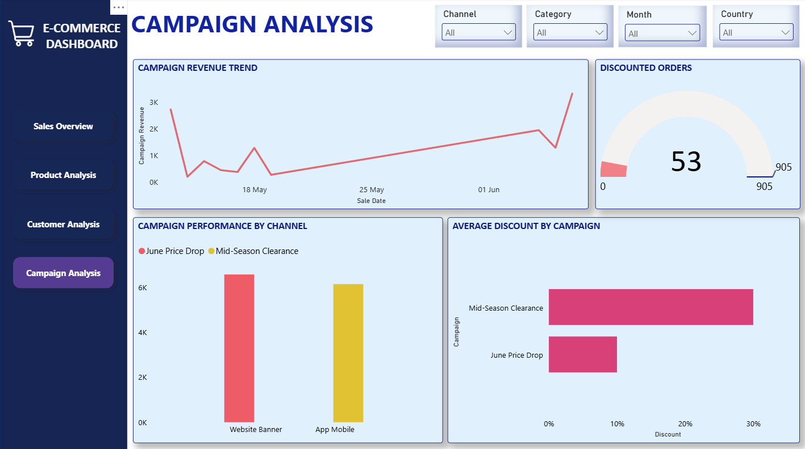

# 🛒 E-Commerce Sales Analytics Dashboard - Power BI


An interactive multi-page **Power BI** dashboard analyzing e-commerce sales, product, customer, and campaign performance, with dynamic filtering by Channel, Category, Month, and Country.

---

## 1. Executive Summary

This project transforms raw e-commerce transactional data into a fully interactive Power BI dashboard covering **905 orders**, **~1K customers**, and **7K units sold**, generating **324.24K in revenue**, **141.15K in profit**, and a **43.53% profit margin**.

The dashboard is organized into four connected report pages — **Sales Overview, Product Analysis, Customer Analysis, and Campaign Analysis** — allowing stakeholders to move from a high-level performance snapshot down to category, customer, and campaign-level detail, all filterable in real time by Channel, Category, Month, and Country.

The goal was to turn scattered order-level data into a decision-ready reporting tool that answers: *where is revenue coming from, what is driving profit, who are our customers, and are our marketing campaigns working?*

---

## 2. Business Problem

E-commerce businesses generate large volumes of transactional data across multiple sales channels, product categories, and geographies — but without a consolidated view, this data is hard to act on. Stakeholders were facing common challenges:

- **No single source of truth** for revenue, profit, and order performance across channels and countries.
- **Limited visibility into product-level profitability** — which categories/products drive revenue vs. which drain margin.
- **Unclear customer profile** — no clear picture of age demographics, geographic spread, or signup trends over time.
- **Unmeasured campaign effectiveness** — discounts and promotions were running without a clear way to track their revenue impact or discount cost.

**Objective:** Build a self-service analytics dashboard that consolidates sales, product, customer, and campaign data into one interactive tool, enabling faster, data-driven decisions without needing to query raw data manually.

---

## 3. Methodology & Skills

### Data Analysis Process
1. **Data Collection** – Consolidated raw transactional/order-level e-commerce data (sales, customers, products, campaigns).
2. **Data Cleaning & Transformation** – Standardized fields (Channel, Category, Country, Month), handled data types, and structured tables for relational modeling using Power Query.
3. **Data Modeling** – Built a relational data model connecting sales, product, customer, and campaign tables to support cross-page slicing and filtering.
4. **Measure Creation (DAX)** – Developed calculated measures for Total Revenue, Total Profit, Profit Margin, Units Sold, Discounted Orders, and Average Discount.
5. **Dashboard Design** – Designed a 4-page report (Sales Overview, Product Analysis, Customer Analysis, Campaign Analysis) with a consistent layout, color system, and global slicers.
6. **Geospatial Analysis** – Used map visuals to visualize revenue, orders, and customers by country.
7. **Validation** – Cross-checked KPI totals and visual breakdowns for consistency across pages and filters.

### 🔗 Skills Demonstrated

`Power BI` `Power Query` `Data Cleaning` `Data Modeling` `DAX` `KPI Development`  `Campaign & Marketing Analytics` `Customer Segmentation` `Dashboard Design` `Data Storytelling`

---

## 4. Results

### Key Performance Indicators

| KPI | Result |
|---|---|
| 💰 Total Revenue | **324.24K** |
| 📊 Total Profit | **141.15K** |
| 📦 Total Orders | **905** |
| 📈 Units Sold | **7K** |
| 👥 Total Customers | **1K** |
| 📉 Profit Margin | **43.53%** |

### 🔎 Key Findings

**Sales Performance**
- Revenue peaked in **May**, then declined into **June**.
- **App Mobile (52.95%)** narrowly outperforms **E-commerce web (47.05%)** in revenue share.
- **Germany, France, and Italy** are the top three revenue-generating countries; **Portugal** trails the list.

**Product Performance**
- **Shoes** and **T-Shirts** together account for the largest share of category revenue (treemap view).
- **Dresses** leads in order volume, but not necessarily in profit — revenue vs. profit comparison shows some categories carry thinner margins.
- The **top 5 products** collectively account for roughly even shares of ~18–24% each of top-product revenue, indicating no single "hero SKU" dominance.
- Stock levels are healthiest for **Pants (L)** and **T-Shirts (S)**, both above 1,500 units.

**Customer Insights**
- The **16–35 age bracket** represents the largest customer segments, with a gradual decline through older age groups (56–65 lowest).
- Customer base is concentrated in **Germany, Italy, France, and Spain**.
- Signups **peaked in March (~230)** then dropped sharply after May, flattening at a low, steady level through year-end — signaling a customer acquisition slowdown.

**Campaign Performance**
- Only **53 of 905 orders (~5.9%)** involved a discount — discounting is a small share of total order volume.
- **Mid-Season Clearance** carries a noticeably **higher average discount (~20%+)** than **June Price Drop (~13%)**.
- **Website Banner** slightly outperforms **App Mobile** in campaign-driven revenue.
- Campaign revenue dipped mid-period before recovering sharply toward the most recent date.

---

## 5. Business Recommendations

1. **Investigate the June revenue decline.** Revenue dropped notably after peaking in May — analyze whether this is seasonal, channel-specific, or tied to reduced campaign activity, and plan a corrective push (e.g., a targeted promotion) for the following month.
2. **Double down on App Mobile.** Since App Mobile drives the largest single revenue share, prioritize mobile UX improvements, mobile-exclusive offers, and mobile ad spend to compound this advantage.
3. **Re-evaluate Mid-Season Clearance discount depth.** Its average discount is notably higher than June Price Drop — confirm it's still delivering incremental profit and not just shifting already-planned purchases at a lower margin.
4. **Protect margin in high-volume, lower-margin categories.** Categories with high order volume but comparatively lower profit (per the revenue-vs-profit chart) should be reviewed for pricing, supplier cost, or bundling opportunities.
5. **Address the customer signup slowdown.** Signups fell sharply after May and have stayed flat — this warrants a renewed acquisition campaign (referral incentives, paid social, influencer partnerships) especially targeted at the high-performing 16–35 age segment.
6. **Expand geographically with intent.** Germany, France, and Italy are already strong — consider testing localized campaigns in Netherlands and Spain, which show mid-tier performance and room to grow, before over-investing in lower-performing Portugal.
7. **Right-size inventory using stock data.** Cross-reference the Stock Availability table with the Top 5 Products/Quantity Sold visuals to avoid overstocking slow-moving SKUs and stockouts on fast movers.

---

## 6. Features & Highlights

- 🧭 **4-page interactive navigation** — Sales Overview, Product Analysis, Customer Analysis, Campaign Analysis, all accessible from a persistent sidebar.
- 🎛️ **Global slicers** (Channel, Category, Month, Country) that filter consistently across every page.
- 📈 **KPI cards** for at-a-glance performance tracking (Revenue, Profit, Orders, Units Sold, Customers, Margin).
- 🗺️ **Geospatial visuals** mapping revenue, orders, and customers by country.
- 🍩 **Channel & category breakdowns** via donut, treemap, and bar visuals for quick share-of-total comparisons.
- 🎯 **Campaign performance tracking**, including a discount gauge and average-discount-by-campaign comparison.
- 📦 **Live stock availability table** segmented by category and size.
- 🎨 **Consistent visual theme** — unified color palette, typography, and card-based layout across all pages for a polished, professional feel.
- 💼 **Business-focused visualization** — unified color palette, typography, and card-based layout across all pages for a polished, professional feel.
---

## 7. Project Structure

```
├── ecommerce-dashboard.pbix        # Power BI report file
├── /screenshots
│   ├── Salesoverview.png
│   ├── ProductAnalysis.png
│   ├── CustomerAnalysis.png
│   └── CampaignAnalysis.png
|                         
└── README.md
```
## 8. Dashboard Preview
  
  
  
  


---

## 8. Project Takeaway

This project demonstrates the ability to take raw, disconnected e-commerce data and turn it into a structured, interactive, decision-ready analytics tool. Beyond building charts, it required thinking like an analyst *and* a business stakeholder — identifying which questions matter (channel performance, product profitability, customer trends, campaign performance), modeling the data to answer them cleanly, and designing a report that non-technical users can navigate confidently.

It reinforced core end-to-end BI skills: data modeling, DAX measure design, geospatial analysis, and dashboard UX — while also sharpening the ability to translate visual patterns into concrete, actionable business recommendations rather than just descriptive charts.
